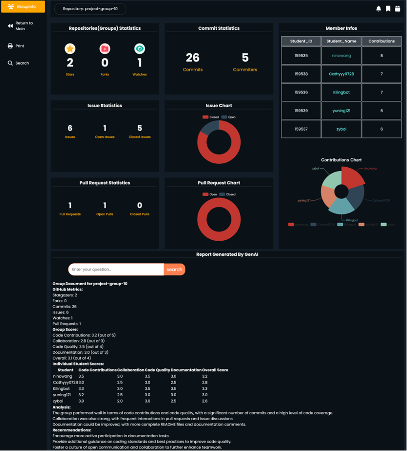

   | Version | Date       | description                   | Author |
   | ---- | ---------- | ---------------------- | ---- |
   | 1.0  | 01/03/2024 | Functional requirement analysis, module design | Kilingbot,ninowang,zyboi,Cathy,Yuning |
   | 1.1  | 04/03/2024 | Design prototypes | zyboi,Cathy,Yuning |
   | 1.2  | 10/03/2024 | Github API interface design | Kilingbot |
   | 1.3  | 17/03/2024 | Github API interface refinement | Kilingbot |
   | 1.4  | 18/03/2024 | Front-end page framework Implemented | zyboi,Yuning,Cathy |
   | 2.0  | 20/03/2024 | OverView Page&GroupPage Implemented | zyboi |
   | 2.1  | 20/03/2024 | StudentPage Implemented | Yuning |
   | 2.2  | 21/03/2024 | Front-end interface document design | ninowang |
   | 2.3  | 24/03/2024 | Front and back end connectivity completed | Kilingbot,ninowang,zyboi,Cathy,Yuning |
   | 3.0  | 28/03/2024 | Genai function Implemented | ninowang |
   | 3.1  | 31/03/2024 | Genai connected to front and back end  | Kilingbot,ninowang,zyboi,Cathy,Yuning |
   | 3.2  | 04/04/2024 | Added genai Q&A feature to front-end | Cathy |
   | 3.3  | 05/04/2024 | Unit testing | ninowang |
   | 3.4  | 06/04/2024 | Front-end page optimization | Cathy,zyboi,Yuning |

# Running

First start the backend server

```
pip install requirement.txt
sudo apt update
sudo apt install redis-server
redis-server

python main.py
```

Note: Due to google policy, it can not be used directly in Hong Kong China, you can start the back-end server through codespace, at this time, pay attention to set the port to public, otherwise there may be CORS problems.

Next start the front end

```
cd ./frontend
python app.py
```

Then you can access the page. Please note that if you want to access the page locally, please change the url information in the corresponding js file.

# Demonstration

The first is the main page, which shows in the top left corner what the current organisation is.


You can click on the repository name at the bottom of the page to go to the specific repository display page:



When you enter this page, genai will be called automatically to generate a group document, if not, please click refresh and wait patiently. In the meantime you can get more information by entering more information in the input box. By clicking on the group information in the upper right corner, you can go to the group details page, which will also automatically generate a group document, and you can also choose to enter it freely.


Group member activities are generally divided into commit, issue and pull request, you can click the corresponding button to view the student activities, and by clicking the url link, you can enter the activity corresponding to the github page, such as the issue page you can view the member of the specific issue raised.

# Background
The purpose of this document is to define the requirements for a web application that will help instructors track the progress of different groups in a course and understand the collaboration between group members. The application will analyse various student activities such as commits, issues and pull requests in the GitHub repository. It will provide instructors with dashboards and statistics to provide insights about different group activities and individual student contributions to the project.

# Goal 
The goal of the system is to help teachers track the progress of different groups and to understand the students' activities and collaboration in the project. By analysing the data provided by the GitHub API, the system will provide the following features:
Tracking the activities of different groups such as commit frequency, project panels, issues, code changes, discussions/comments, assigned issues, pull requests, milestones, bug reports, task completion, etc. 

Provide dashboard and report generation functionality so that the instructor can track the progress of different groups and students' engagement in the project.

# Functional Modules
1. Student data collection: the system will collect student activity and collaboration data in the repository such as commits, issues, pull requests, etc. via the GitHub API. 

2. Dashboards: The system should provide visual dashboards to display activity statistics for different groups, such as frequency of submissions, number of issues, status of pull requests, etc.

3. Student data presentation: the system shall provide student data showing the activity and contribution of each student, such as number of submissions, number of pull requests, number of questions, etc.

4. Panel data presentation: The system should provide panel data showing the activity and contribution of each panel, such as the number of panel submissions, the number of pull requests, the number of questions, etc. 

5. Exporting reports: The system should allow teachers to export student reports and group reports for further analysis and sharing.

# Modules Design
1. Database Module

2. GitHub APi Modules, Pulls, Updates

3. Front-end interface

4. Back-end interface

# Non-functional requirements
1. Response time

2. Error rate

3. User friendliness

# Prototype design
Refer to [prototypes](https://github.com/COMP5241-2324-Project/project-group10/tree/genai_test/prototypes)

# Interface design
1. Use of GITHUB API：These interfaces are mainly used for persistent storage to a local database after fetching the required data from the github api.

2. Back-end interface framework：MySQL + Flask

3. Database type：Mysql + Navicat

4. Back-end test interface tools：POSTMAN

5. Online GITHUB API testing site：https://github.apifox.cn/

| Interface address | Interface path  | Required Respond Parameters | Functional Description |
|-------|-------|---------|---------|
| orgs.Get an organization   | GET /orgs/{org} | id,description,followers,public_repos,total_private_repos | Get an organisation's Id, description, followers, number of public repos and private repos |
| repos.List organization repositories   | GET /orgs/{org}/repos | id,name,created_at,forks_count,stargazers_count,watchers_count,language| Get the name,id,forks_count,stargazers_count,watchers_count,language etc. of all the organisation repositories under an organisation (show the list of repos in the Org layer and enable jumping to the repos layer) |
| repos.List commits | GET /repos/{owner}/{repo}/commits  | response.length  | Get commits related to a repository |
| pulls.List pull requests | GET /repos/{owner}/{repo}/pulls?state=  | response.length  | Get information about the pulls of a repository, filtering the state by state |
| issues.List repository issues | GET /repos/{owner}/{repo}/issues?state=  | response.length  | Get the issues related to a repository, filtering by state |
| repos.List repository contributors | GET /repos/{owner}/{repo}/contributors  | login, name, email, contributions  |Get all the contributors of a repository, contributions are used to rank and pull a list of all the contributors under a repository (for page jumps) |
| repos.Get all contributor commit activity | GET /repos/{owner}/{repo}/stats/contributors  | Get the number of user contributions under a repository |
| repos.List repository teams | GET /repos/{owner}/{repo}/teams  | name |Get the team of a user(team -> user) under a repository |
| activities related interface |  |  | Get all the code activities (pull,commit,create...) of a user in the last week/month/year |


2. Front-end and back-end exchange interfaces:


| Interface | Path  | Required Respond Parameters|
|---------|---------|---------|

Front-end interface details：https://apifox.com/apidoc/shared-0cdff960-eff9-4893-a45e-9c9897076b5c/api-156313894

# Testing
Completion of unit tests，refer to [test](https://github.com/COMP5241-2324-Project/project-group10/tree/genai_test/test)

# Milestones, schedule
| No. | Tasks                  | Start time   | End time   |  Responsible student |
   | ---- | ---------------------- | ---------- | ---------- | ------ |
   | 1    | Functional requirements analysis, module design | 01/03/2024 | 01/03/2024 | WANG Xinyu |
   | 2    | Prototypes Design   | 01/03/2024 | 06/03/2024 | ZHU Yibo |
   | 3    | Back-end interface & database design | 02/03/2024 |            |    QIN Linbo，WANG Xinyu  |
   | 4    | Front-end design | 01/03/2024 |            |    XIAO Bowen, XU Yuning, ZHU Yibo    |
   | 5    | Testing |            | 05/04/2024     | WANG Xinyu     |
   | 6    | Improve documentation [continuity] | 01/03/2024 |            |        |

First Version：Implementation of basic pages, database connectivity.

Second Version：Implement github api calls for data visualisation.

Third Version：Optimise system, fix bugs.
